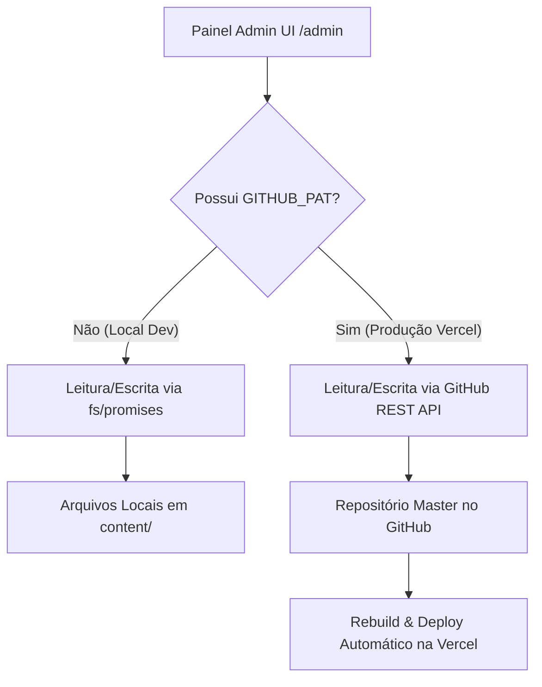

# Git-CMS Architecture & Reference Manual

Este documento serve como referência de arquitetura para o **Git-CMS Serverless** implementado neste projeto. O sistema permite que o cliente edite todo o conteúdo do site através de um painel administrativo seguro (`/admin`), salvando as alterações diretamente no repositório do GitHub (via API REST) em produção, e no sistema de arquivos local (`fs`) em desenvolvimento, eliminando a necessidade de um banco de dados ou backend dedicado.

---

## 🗺️ Visão Geral da Arquitetura

O Git-CMS opera de forma híbrida e adaptativa:



- **Ambiente Local (Desenvolvimento)**: Lê e escreve arquivos JSON diretamente no diretório `content/` do computador usando a API do Node.js (`fs/promises`).
- **Ambiente de Produção (Vercel)**: Utiliza a API REST do GitHub para buscar os arquivos, atualizar seu conteúdo e commitar as alterações diretamente na branch principal (`master`), disparando um novo deploy automático da Vercel para atualizar o site público.

---

## 📂 Estrutura de Diretórios e Componentes

A estrutura de arquivos do Git-CMS está organizada da seguinte forma:

```
├── content/                    # Arquivos JSON de dados (flat-file database)
│   ├── global/
│   │   └── site.json           # SEO global, Headings e textos estáticos
│   ├── pricing/
│   │   └── plano-*.json        # Detalhes e recursos de cada plano
│   └── portfolio/
│   │   └── projeto-*.json      # Projetos do portfólio
│
├── src/
│   ├── lib/
│   │   └── github.js           # Cliente de API REST do GitHub com fallback para FS
│   │
│   ├── pages/
│   │   ├── admin.jsx           # Rota do Painel Admin (Container com Route Guard)
│   │   ├── admin/
│   │   │   └── login.jsx       # Interface visual de Login Administrativo
│   │   │
│   │   └── api/
│   │       ├── admin/
│   │       │   ├── login.js    # Injeta cookie HTTP-Only seguro
│   │       │   ├── check.js    # Valida sessão atual
│   │       │   └── logout.js   # Expirador de cookie
│   │       └── content/        # Endpoints de leitura/escrita do CMS
│   │           ├── global.js
│   │           ├── pricing.js
│   │           ├── pricing/[id].js
│   │           ├── portfolio.js
│   │           └── portfolio/[id].js
│   │
│   └── components/
│       └── Admin/              # Componentes isolados do Painel Admin (SOLID)
│           ├── ui.jsx          # Design Tokens (Dark Studio), Inputs primitivos e botões
│           ├── Sidebar.jsx     # Menu lateral e botão de publicar
│           ├── GlobalSEOSection.jsx # Edição de Textos Globais & SEO
│           ├── PricingSection.jsx   # Listagem e formulário de planos
│           ├── PortfolioSection.jsx # Grade de projetos e filtros
│           └── ProjectModal.jsx     # Modal de edição/criação de projetos com thumbnail preview
```

---

## 🔒 Fluxo de Autenticação Segura (Route Guard)

Para proteger o acesso ao painel e às APIs sem expor dados confidenciais:

1. **Geração do Cookie de Sessão**:
   Ao digitar a senha correta (definida no servidor pela variável `ADMIN_PASSWORD`), a API `/api/admin/login` gera um cookie criptografado chamado `admin_session`:
   - `HttpOnly`: Impede acesso ao cookie via JavaScript do navegador (mitiga ataques XSS).
   - `SameSite=Strict`: Impede o envio do cookie em requisições cross-site (mitiga ataques CSRF).
   - `Secure`: Força o tráfego do cookie apenas sob HTTPS (ativo em produção).
   - `Path=/`: Válido para todo o domínio.

2. **Middleware Guard na Rota (`getServerSideProps`)**:
   No arquivo `src/pages/admin.jsx`, a verificação de sessão ocorre no servidor antes da página ser renderizada:
   ```javascript
   export async function getServerSideProps(ctx) {
     const cookies = ctx.req.headers.cookie || '';
     const isAuthenticated = cookies.includes('admin_session=authenticated');

     if (!isAuthenticated) {
       return {
         redirect: {
           destination: '/admin/login',
           permanent: false
         }
       };
     }
     
     // Carrega os dados para o painel...
     return { props: { ... } };
   }
   ```

3. **Proteção nos Endpoints de API**:
   Todos os endpoints em `/api/content/*` verificam o cookie `admin_session` nas requisições de escrita (`POST`, `PUT`, `DELETE`). Requisições não autorizadas retornam `401 Unauthorized`.

---

## ⚙️ Funcionamento das Operações de Escrita via GitHub API

Para salvar ou excluir arquivos diretamente no GitHub através do servidor serverless, realizamos o seguinte fluxo:

1. **Obtenção do SHA do Arquivo**:
   O GitHub exige o hash SHA do arquivo atual antes de permitir qualquer alteração ou deleção. Fazer isso garante que não sobrescrevamos alterações concorrentes acidentalmente.
   - Chamamos a API de conteúdo do GitHub: `GET /repos/{owner}/{repo}/contents/{path}`.
   - Extraímos o campo `sha` da resposta.

2. **Commit e Envio de Dados**:
   - O conteúdo do arquivo JSON é serializado e codificado em **Base64**.
   - Chamamos a API do GitHub: `PUT /repos/{owner}/{repo}/contents/{path}` enviando o `sha`, o conteúdo em Base64 e uma mensagem de commit (ex: `chore(cms): update content`).
   - O GitHub cria o commit diretamente na branch (ex: `master`).

3. **Integração Serverless**:
   Implementado no arquivo [github.js](file:///c:/Users/rafaelRibeiro/Documents/Pessoal/Rafael%20Tech/src/lib/github.js):
   - `getFile(path)`: Retorna `{ content, sha }`.
   - `writeFile(path, content, message)`: Obtém o SHA atual (se existir) e envia o commit de escrita.
   - `writeBinaryFile(path, base64Content, message)`: Obtém o SHA atual e envia o commit de escrita binária (base64).
   - `deleteFile(path, message)`: Obtém o SHA e envia a requisição de remoção.

---

## 🖼️ Tratamento e Upload de Imagens do Dispositivo

Para permitir que o usuário faça o upload de fotos de seu próprio computador ou celular sem sobrecarregar o repositório Git com arquivos gigantes, implementamos uma pipeline de otimização no lado do cliente:

1. **Otimização no Cliente ([imageOptimizer.js](file:///c:/Users/rafaelRibeiro/Documents/Pessoal/Rafael%20Tech/src/lib/imageOptimizer.js))**:
   - Resolução máxima de largura/altura travada em `1200px` mantendo a proporção.
   - Compressão de qualidade em `82%` e conversão automática para formato **WebP** (com fallback automático para JPEG se o navegador não for compatível).
   - Sanitização de nome de arquivos (remove acentos, espaços e caracteres especiais) e adiciona um timestamp para evitar colisões no Git.

2. **Segurança no Endpoint ([upload.js](file:///c:/Users/rafaelRibeiro/Documents/Pessoal/Rafael%20Tech/src/pages/api/admin/upload.js))**:
   - Limitador rígido de tamanho: arquivos maiores que 1MB após compressão são rejeitados no backend.
   - Route guard de cookie de sessão ativo.
   - Validação contra ataques de *Path Traversal* (impede escrita fora da pasta `public/uploads`).

---

## 🎨 Princípios Visuais do Admin (Dark Studio Design)

Todo o layout do painel administrativo segue a estética **Dark Studio**:
- **Background Principal**: `#09101f` (azul profundo escuro).
- **Cards & Sidebar**: `#0f1828` e `#06c018` para criar profundidade visual.
- **Bordas finas translúcidas**: `1px solid rgba(255, 255, 255, 0.07)`.
- **Destaques em Degradê / Neon**: Tons de ciano (`#06b6d4`) e esmeralda (`#10b981`).
- **Nenhum Estilo Inline Ad-hoc**: Todos os botões, inputs, toggles e cabeçalhos devem ser importados do primitivo [ui.jsx](file:///c:/Users/rafaelRibeiro/Documents/Pessoal/Rafael%20Tech/src/components/Admin/ui.jsx) para manter a consistência da interface.
